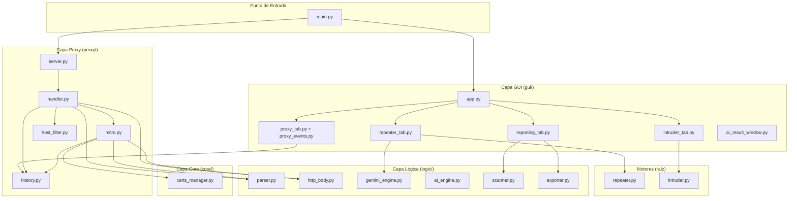

# Análisis Arquitectónico — PROYECTO_BURP_PYTHON

> **Mini-Burp Suite** · Python · CustomTkinter · Proxy MITM + IA (Gemini)
> Autores: Diogo Nicolas Rodriguez Gomez, Javier Soliz Rueda — Ingeniería de Software 2

---

## 1. Estructura General de Carpetas

```
PROYECTO_BURP_PYTHON/
├── main.py                  ← Punto de entrada
├── requirements.txt
├── filter_hosts.conf
├── .env                     ← GEMINI_API_KEY
│
├── core/                    ← Módulo A: Infraestructura de bajo nivel
│   └── certs_manager.py
│
├── proxy/                   ← Módulo B: Proxy MITM HTTP/HTTPS
│   ├── server.py
│   ├── handler.py           ← Orquestador de conexiones
│   ├── mitm.py              ← Intercepción TLS
│   ├── history.py           ← Historial de peticiones
│   └── host_filter.py       ← Filtrado de dominios
│
├── logic/                   ← Módulo C/D/E: Lógica de negocio pura
│   ├── parser.py            ← Parser HTTP
│   ├── http_body.py         ← Descompresión y render de cuerpos
│   ├── ai_engine.py         ← Motor IA local (Ollama)
│   ├── gemini_engine.py     ← Motor IA en la nube (Google Gemini)
│   ├── scanner.py           ← Análisis pasivo de seguridad
│   └── exporter.py          ← Exportación de reportes (PDF/CSV)
│
├── gui/                     ← Módulo GUI: Interfaz gráfica (CustomTkinter)
│   ├── app.py               ← Ventana raíz + orquestador de pestañas
│   ├── header.py            ← Barra superior de navegación
│   ├── proxy_tab.py         ← Pestaña Proxy (historial + intercept)
│   ├── proxy_events.py      ← Mixin de eventos de ProxyTab
│   ├── repeater_tab.py      ← Pestaña Repeater + WAF Copilot (IA)
│   ├── intruder_tab.py      ← Pestaña Intruder (ataque con payloads)
│   ├── reporting_tab.py     ← Pestaña Reporting (análisis pasivo)
│   ├── ai_result_window.py  ← Ventana flotante de resultados IA
│   ├── colors.py            ← Sistema de tokens de color
│   └── utils.py             ← Utilidades GUI (syntax highlighting)
│
├── intruder.py              ← Motor Intruder (fuera del paquete gui/)
├── repeater.py              ← Motor Repeater (fuera del paquete gui/)
│
├── tests/                   ← Suite de pruebas unitarias
│   ├── test_proxy.py
│   ├── test_http_body.py
│   ├── test_ai_engine.py
│   ├── test_gemini_engine.py
│   ├── test_scanner.py
│   ├── test_exporter.py
│   └── test_host_filter.py
│
└── Documentos/              ← Documentación del proyecto
```

---

## 2. Propósito de Cada Módulo Clave

### `main.py` — Punto de Entrada

| Aspecto | Detalle |
|---|---|
| **Responsabilidad** | Bootstrap: parsea args CLI → arranca `ProxyServer` en hilo daemon → configura CTk → lanza `App`. |
| **Patrón** | Flujo secuencial de 4 pasos, bien comentado. |
| **Calidad** | Excelente. Mínimo, sin lógica embebida. Soporta `python main.py [host] [port]`. |

---

### `gui/app.py` — Orquestador de la Ventana Principal

| Aspecto | Detalle |
|---|---|
| **Responsabilidad** | Construye el `CTkTabview` con las 4 pestañas: Proxy, Repeater, Intruder, Reporting. Gestiona la navegación entre pestañas via `switch_to_repeater()` y `switch_to_intruder()`. |
| **Patrón** | Composición de widgets. `App` hereda `ctk.CTk`. Cada pestaña es una clase independiente. |
| **API pública** | `switch_to_repeater(raw_request)`, `switch_to_intruder(raw_request)` — implementan CU-05. |
| **Calidad** | Muy buena separación. La App actúa como mediador entre pestañas sin conocer sus internos. |

---

### `gui/proxy_tab.py` + `gui/proxy_events.py` — Pestaña Proxy

| Archivo | Responsabilidad |
|---|---|
| `proxy_tab.py` | Construcción visual: Treeview del historial, paneles Request/Response, toolbar. Hereda de `ProxyEventsMixin`. |
| `proxy_events.py` | **Mixin** con toda la lógica de eventos: toggle intercept, Forward, Drop, selección de fila, Send to Repeater, auto-scroll, export CSV. |

**Patrón destacable:** El Mixin accede a `self` asumiendo los atributos definidos en `ProxyTab`. Esto separa visualmente UI de comportamiento pero crea un **acoplamiento implícito** entre ambos archivos (documentado explícitamente en el docstring del mixin).

**Implementa:** CU-03 (Historial), CU-04 (Intercept ON/OFF), CU-05 (Send to Repeater).

---

### `gui/repeater_tab.py` — Pestaña Repeater + WAF Copilot

| Aspecto | Detalle |
|---|---|
| **Responsabilidad** | Panel dual Request/Response editable. Envío HTTP vía `Repeater.send()`. Copiloto IA con `GeminiEngine`. |
| **Threading** | Envío HTTP y consulta IA en hilos daemon; resultados publicados con `widget.after(0, callback)` (thread-safe con Tkinter). |
| **IA** | Botón "🤖 Ask AI (Bypass WAF)" → llama a `GeminiEngine.suggest_waf_bypass()` → abre `AIResultWindow` con tarjetas de técnicas. |
| **Inyección de payload** | `apply_ai_payload()` aplica heurísticas: Regla A (verbos HTTP), Regla B (cabeceras), Regla C (body/clipboard). |
| **Calidad** | Muy completo. Manejo de errores granular con `GeminiConfigError`, `GeminiConnectionError`, `GeminiResponseError`. |

> [!NOTE]
> El mensaje de error en `_on_ai_error()` (línea 549) aún menciona "Ollama" en lugar de "Gemini", residuo de la migración desde Ollama a Gemini. Es un texto de ayuda menor, no afecta funcionalidad.

---

### `gui/intruder_tab.py` — Pestaña Intruder

| Aspecto | Detalle |
|---|---|
| **Responsabilidad** | Editor de templates con marcadores `§payload§`, carga de diccionarios (SQLi, XSS, Path Traversal, personalizado), ejecución del ataque en hilo daemon, tabla de resultados coloreada por HTTP status. |
| **Patrón** | Mismo patrón de threading que `repeater_tab.py`: hilo daemon + `after(0, callback)`. |
| **Implementa** | CU-08 (marcadores §§), CU-09 (diccionarios), CU-10 (ataque multi-hilo con Stop). |
| **Calidad** | Bien estructurado. El coloreado por rango de status (2xx/3xx/4xx/5xx) es claro. |

---

### `logic/parser.py` — Parser HTTP

| Aspecto | Detalle |
|---|---|
| **Responsabilidad** | Única: convertir `bytes` HTTP crudos → `ParsedRequest` dataclass. No abre sockets, no imprime, no gestiona hilos. |
| **SRP** | Cumple perfectamente. El docstring lo proclama explícitamente. |
| **Soporta** | URL absoluta (`http://host/path`), URL relativa (`/path` + Header `Host:`), `CONNECT host:443` (túnel HTTPS). |
| **Calidad** | Excelente. Código defensivo: `try/except Exception → None` en toda la función pública. `display_host()` centraliza la lógica de presentación. |

---

### `logic/http_body.py` — Descompresión y Render de Cuerpos HTTP

| Aspecto | Detalle |
|---|---|
| **Responsabilidad** | Descomprimir (gzip/deflate/brotli), de-chunkar, detectar binarios y retornar una cadena legible para la GUI. |
| **Solo lectura** | No modifica los bytes que se reenvían al servidor; es **solo para visualización**. |
| **Robusto** | Maneja Transfer-Encoding chunked **antes** de descomprimir (orden correcto). Fallback a ASCII en caso de error. |
| **Calidad** | Muy buena. Lógica de detección binaria con ratio de caracteres no imprimibles (> 30% = binario). |

---

### `logic/gemini_engine.py` — Motor IA en la Nube (Google Gemini)

| Aspecto | Detalle |
|---|---|
| **Responsabilidad** | Comunicarse con la API de Google Gemini para generar sugerencias de evasión de WAF. |
| **Configuración** | API Key desde `.env` via `python-dotenv`. Modelos: `gemini-2.5-flash` (default) y `gemini-2.5-pro`. |
| **Output forzado** | `response_mime_type="application/json"` fuerza JSON estructurado. |
| **Jerarquía de errores** | `GeminiEngineError` → `GeminiConfigError` / `GeminiConnectionError` / `GeminiResponseError`. |
| **Prompt** | Solicita exactamente 5 técnicas en array JSON con `{tecnica, payload, explicacion}`. |
| **Calidad** | Buena. El `_build_prompt` declara 5 ítems en el ejemplo pero la instrucción dice "EXACTAMENTE 3" — inconsistencia menor. |

---

### `logic/ai_engine.py` — Motor IA Local (Ollama) — Módulo Legado

| Aspecto | Detalle |
|---|---|
| **Responsabilidad** | Cliente HTTP para el servidor Ollama local (`localhost:11434`). |
| **Estado** | Módulo original, **desplazado por `gemini_engine.py`** en la versión actual. |
| **Calidad** | Bien documentado. `get_installed_models()` consulta `/api/tags` dinámicamente. `is_available()` verifica conexión antes de mostrar UI. |

---

### `logic/scanner.py` — Análisis Pasivo de Seguridad (CU-11)

| Aspecto | Detalle |
|---|---|
| **Responsabilidad** | Analizar el historial capturado sin hacer nuevas peticiones de red. |
| **Detecciones** | Cabeceras de seguridad faltantes (HSTS, X-Frame-Options, CSP, nosniff), fugas de versión en `Server`/`X-Powered-By`, errores 5xx, llaves privadas expuestas, errores de base de datos en el body. |
| **Niveles de severidad** | Critical / High / Medium / Low / Info. |
| **Calidad** | Buen diseño. Separación en métodos `_check_*` independientes. El `scan_history()` ignora correctamente túneles CONNECT. |

---

### `proxy/handler.py` — Procesador de Conexiones

| Aspecto | Detalle |
|---|---|
| **Responsabilidad** | Orquesta el ciclo completo: recibir → parsear → filtrar → [intercept] → reenviar → loggear → historial. |
| **Clases** | `PendingRequest` (petición pausada con `threading.Event`), `InterceptController` (cola de intercepción), `ConnectionHandler` (orquestador). |
| **Thread-safety** | `_next_id()` protegido con `threading.Lock`. |
| **Intercept** | Bloquea el hilo del handler con `pending.wait()`. El timeout del socket del cliente se desactiva durante la espera interactiva. |
| **Calidad** | Excelente gestión de recursos (`finally: socket.close()`). Degradación segura ante fallos del filtro. |

---

### `proxy/mitm.py` — Interceptación SSL/TLS

| Aspecto | Detalle |
|---|---|
| **Responsabilidad** | MITM completo de HTTPS: conectar al servidor real → responder 200 → handshake TLS doble → loop de peticiones descifradas. |
| **Flujo** | El proxy actúa como cliente TLS hacia el servidor y como servidor TLS hacia el navegador, usando certificados generados por `CertsManager`. |
| **Loop** | Soporta HTTP/1.1 keep-alive: múltiples request/response por sesión TLS. |
| **Calidad** | Muy completo. `_send_safe()` y `_close_safe()` como helpers defensivos. Fallback a túnel ciego si falla el handshake. |

---

## 3. Evaluación de la Arquitectura

### 3.1 Mapa de Capas



### 3.2 Puntos Fuertes ✅

| Fortaleza | Detalle |
|---|---|
| **SRP aplicado** | `parser.py` solo parsea. `http_body.py` solo descomprime. `proxy_events.py` solo maneja eventos. Cada módulo tiene una razón de cambio. |
| **Threading correcto** | Ningún hilo worker toca Tkinter directamente; todos usan `widget.after(0, callback)`. El `threading.Event` del intercept es elegante. |
| **Documentación interna** | Cada módulo tiene un docstring de módulo completo con responsabilidades, autores y relaciones. Los métodos tienen Args/Returns documentados. |
| **Gestión de recursos** | Sockets siempre cerrados en `finally`. `_send_safe()` y `_close_safe()` como guardias. |
| **Jerarquía de errores** | `GeminiEngineError` con 3 subclases específicas permite manejo granular en la GUI. |
| **Sistema de colores** | `colors.py` centraliza todos los tokens de diseño, evitando "magic strings" de color dispersos. |
| **Tests unitarios** | Cobertura de los módulos críticos: proxy, scanner, ai_engine, gemini_engine, http_body, exporter, host_filter. |
| **Degradación segura** | El handler devuelve HTTP 500 ante excepciones inesperadas. El filtro de host tiene fallback a SHOW si falla. |

### 3.3 Áreas de Mejora ⚠️

| Problema | Ubicación | Impacto | Sugerencia |
|---|---|---|---|
| **Módulo Ollama legado (`ai_engine.py`) no utilizado** | `logic/ai_engine.py` | Bajo | Documentar claramente como "legado" o eliminarlo si no hay plan de reactivarlo. |
| **Motores en la raíz** | `repeater.py`, `intruder.py` | Medio | Deberían estar en un paquete `engines/` o dentro de `logic/`. Actualmente rompen la estructura de paquetes. |
| **Acoplamiento implícito Mixin** | `proxy_events.py` → `proxy_tab.py` | Medio | El Mixin asume atributos de `ProxyTab`. Considerar una clase base abstracta con las propiedades requeridas, o consolidar en una sola clase. |
| **Inconsistencia en el prompt de Gemini** | `gemini_engine.py` línea 133-139 | Bajo | El system prompt dice "EXACTAMENTE 3 técnicas" pero el prompt user tiene 5 slots de ejemplo. |
| **Texto de error desactualizado** | `repeater_tab.py` línea 549 | Muy bajo | Aún menciona "ollama serve" y "ollama pull llama3" en el mensaje de error de la IA. |
| **`_split_http_response` duplicada** | `handler.py` y `mitm.py` | Bajo | La función está copiada en dos módulos. Extraer a `logic/http_body.py` o a un `proxy/utils.py`. |
| **Sin validación de `.env`** | `gemini_engine.py` | Medio | Si `GEMINI_API_KEY` está vacía, el error solo se muestra al intentar usar el botón. Mejor advertir al arrancar. |

---

## 4. Resumen de Casos de Uso Implementados

| CU | Descripción | Módulos involucrados |
|---|---|---|
| CU-03 | Historial de peticiones | `proxy/history.py`, `gui/proxy_tab.py` |
| CU-04 | Intercept ON/OFF (Forward/Drop/Editar) | `proxy/handler.py`, `gui/proxy_events.py` |
| CU-05 | Send to Repeater | `gui/proxy_events.py` → `gui/app.py` → `gui/repeater_tab.py` |
| CU-06 | Reenvío de peticiones (Repeater) | `repeater.py`, `gui/repeater_tab.py` |
| CU-08 | Template con marcadores §§ | `gui/intruder_tab.py` |
| CU-09 | Carga de diccionarios de payloads | `gui/intruder_tab.py`, `intruder.py` |
| CU-10 | Ataque multi-hilo con Stop | `intruder.py`, `gui/intruder_tab.py` |
| CU-11 | Análisis pasivo (Reporting) | `logic/scanner.py`, `gui/reporting_tab.py` |
| CU-13 | WAF Copilot (IA Gemini) | `logic/gemini_engine.py`, `gui/repeater_tab.py`, `gui/ai_result_window.py` |
| — | MITM HTTPS | `proxy/mitm.py`, `core/certs_manager.py` |
| — | Filtrado de dominios | `proxy/host_filter.py`, `filter_hosts.conf` |
